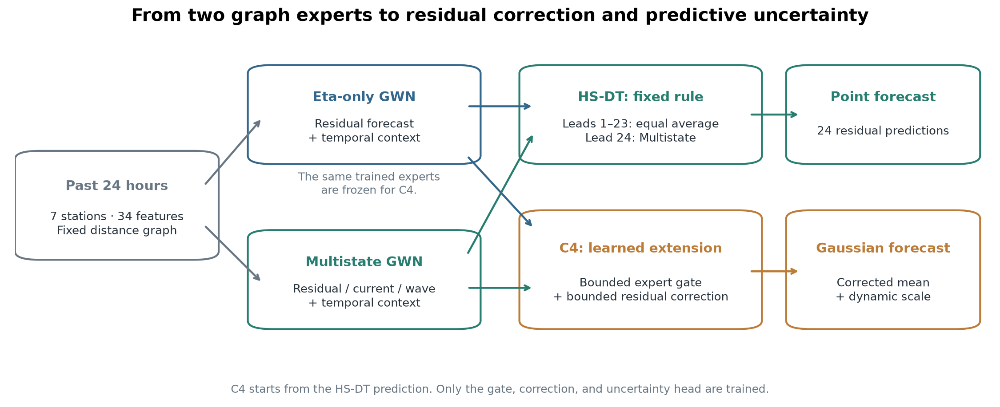
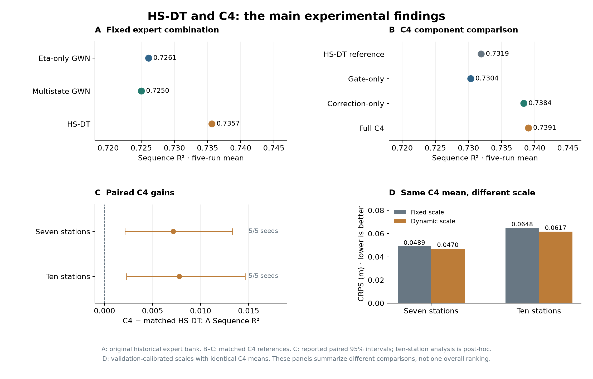

# Coastal Sea-Level Forecasting

We predict the next 24 hours of non-tidal sea-level residuals from the previous 24 hours of observations and environmental inputs. The original network contains seven northeastern US coastal stations and 34 input features. A separate ten-station Delaware network provides an additional spatial evaluation.

The main methods are **HS-DT**, a fixed combination of two Graph WaveNet experts, and **C4**, which learns a bounded correction and predictive uncertainty while keeping those experts frozen.

## Research timeline and development history

This repository was made public after the main experiments were completed. Its Git history therefore shows the cleanup and release process, not the full research timeline. The research itself developed in stages:

| Period | What we worked on | What we learned |
|---|---|---|
| Data preparation | Assembled water level, tide, weather, current, and wave records covering 2023–2025. | Predicting the non-tidal residual separates the target from the tidal signal. |
| Initial comparisons | Tested GNN-BiGRU models, ODE-inspired inputs, and a physical residual loss. | Physical terms helped in some settings, but the gain was not universal. |
| Stronger baselines | Added DCRNN and Graph WaveNet. | A stronger backbone changed the model ranking. |
| July 2026 | Combined Eta-only and Multistate predictions into HS-DT and tested chronological refits. | The fixed combination improved sequence scores; Lead 24 still came directly from Multistate. |
| August 2026 and later analyses | Evaluated the Delaware network and developed C4 with the original HS-DT experts frozen. | Residual correction improved historical point forecasts; dynamic scale improved CRPS. |
| Current release | Removed duplicate scripts, kept the reproducible model paths, and added synthetic checks and result tables. | The public code now highlights the main scientific path and keeps exploratory controls separate. |

The timeline records the order in which questions were tested. It does not present every trial as a successful method. Models that were useful as controls, but did not give a stable gain, remain documented in the supporting results.

### How to read the project

Start with the two experts, then read the HS-DT rule, and finally inspect C4. The result tables identify whether a number comes from the original historical benchmark, a matched C4 comparison, or the later external evaluation. This separation matters because those comparisons use different reference predictions.

For reproducibility, the repository keeps the data sources and preprocessing notes, the model code, the saved summary tables, and small contract tests together. Full forcing data and trained checkpoints are not included because of size and source restrictions. A new run should first check the protocol and data inventory, then report its seed and split before comparing scores.

## From two experts to C4

The **Eta-only expert** predicts the sea-level residual. The **Multistate expert** also predicts current and wave-related states. Both use temporal convolutions and the same fixed distance graph.

**HS-DT** averages their predictions at Leads 1–23 and uses the Multistate forecast at Lead 24. It adds no trainable parameters. This provides a simple reference for testing whether the experts can help each other.

**C4** starts from that rule and adds three learned components:

- A bounded gate adjusts the expert weights using their temporal contexts.
- A bounded residual correction adjusts the combined prediction.
- A Gaussian head estimates a dynamic scale for the predictive distribution.

The experts remain frozen. The gate and correction start at zero adjustment, so C4 initially matches HS-DT. The main C4 model does not use a physical loss; physical variants are separate controls.



## Main results

### HS-DT: sequence gains over individual experts

In the original historical benchmark, Sequence R² is **0.7261** for Eta-only, **0.7250** for Multistate, and **0.7357** for HS-DT. Later evaluations also show sequence gains over the Multistate expert:

| Evaluation period | HS-DT Sequence R² | Gain over Multistate | Positive seeds |
|---|---:|---:|---:|
| 2025 H2 chronological refit | 0.6563 | +0.01243 | 5/5 |
| 2026 H1 frozen evaluation | 0.5385 | +0.01525 | 5/5 |
| July 2026 frozen evaluation | 0.4093 | +0.01773 | 5/5 |

HS-DT and Multistate give identical Lead-24 predictions by construction. The sequence gains therefore do not imply an additional terminal gain.

### C4: residual correction and uncertainty

| Matched comparison | HS-DT Sequence R² | C4 Sequence R² | Paired gain [95% CI] | Positive seeds |
|---|---:|---:|---|---:|
| Seven-station historical test | 0.731914 | 0.739055 | +0.007141 [0.002121, 0.013309] | 5/5 |
| Ten-station Delaware test | 0.680256 | 0.688031 | +0.007775 [0.00229, 0.01462] | 5/5 |

These are five-run mean scores. The seven-station C4 comparison uses its own matched HS-DT reference, not the 0.7357 score from the original expert bank. The ten-station C4 evaluation was added after the original external experiment and is treated as supporting evidence.

The component comparison identifies **residual correction as the main source of historical point-forecast improvement**. Correction-only reaches Sequence R² = 0.738353; Gate-only reaches 0.730351, below the matched HS-DT reference. C4 reduces historical MSE by **2.66%**, but its Lead-24 gain is not statistically clear.

The scale-only control keeps C4's mean prediction unchanged. Dynamic scale reduces CRPS from **0.048927 to 0.047039 m** at seven stations and from **0.064824 to 0.061739 m** at ten stations. All five seeds improve in both comparisons.



The figure separates the original expert bank from the matched C4 comparisons. Data and reported intervals are in [results/main_findings](results/main_findings); the [manuscript](paper/manuscript.pdf) explains the full experiments.

## Supporting comparisons

VARX-Ridge remains a strong linear baseline. Ordinary same-supervision ensembles are also competitive: these tests do not show that different supervision gives a general advantage over Multi+Multi. Matched physical-prior effects are small or mixed. These controls help separate the effects of expert combination, residual correction, and predicted scale. See [the evidence notes](docs/evidence.md) and [control results](results/controls).

## Code

| Component | Role | Implementation |
|---|---|---|
| Fixed-support Graph WaveNet | Dilated temporal convolutions and graph diffusion | `src/models/graph/graph_wavenet.py` |
| Multistate GWN | Predicts residual, current, and wave-related states | `src/training/train_graph_experts.py` |
| HS-DT | Equal expert weights at Leads 1–23; Multistate at Lead 24 | `src/models/ensemble/hsdt.py` |
| C4 | Frozen experts, bounded gate/correction, Gaussian scale | `src/models/correction/c4.py` |
| VARX-Ridge | Strong linear comparator | `src/models/linear/varx.py` |
| Physical-loss GNN-BiGRU | Matched physical-residual diagnostic | `src/models/physics/multistate_gnn_bigru.py` |

```text
src/
  data/          # NOAA/ERA5 acquisition and feature construction
  models/
    graph/       # Fixed-support GWN and DCRNN
    ensemble/    # Fixed HS-DT combination
    correction/  # C4 and its protocol/metric helpers
    linear/      # VARX-Ridge
    physics/     # GNN-BiGRU physical-loss comparator
  training/      # Expert training and matched loss helpers
  evaluation/    # Ensemble and scale-only paired controls
scripts/         # Training, data checks, result viewer
tests/           # Synthetic model invariants
results/         # Small saved result tables
docs/            # Data, evidence, and refactoring notes
paper/           # Current manuscript
```

## Run the code

```bash
python -m pip install -r requirements.txt
python -m unittest discover -s tests -v
python scripts/show_results.py
```

The tests use synthetic inputs. The viewer displays the saved HS-DT and C4 findings. Rebuild the two README figures with `python scripts/build_readme_figures.py`.

Full training requires the processed data listed in [docs/data.md](docs/data.md). Data are not bundled. Model code uses training-fitted transformations and the protocol in `PROTOCOL.json`.

```bash
python scripts/check_data.py
python scripts/train_experts.py --seeds 42 --epochs 120
python src/models/correction/c4.py --seeds 42 --variants C4_HSDT_FROZEN_NO_PHYS --eta-results-root results/tier_a_graph_wavenet --multi-results-root results/tier_a_graph_wavenet
```

Use `--seeds 42 123 2024 2025 3407` for the five-seed experiment. C4 requires expert checkpoints from the previous command. The ensemble and scale controls require saved validation and test prediction caches; see [docs/reproduction.md](docs/reproduction.md).

## Data and scientific scope

The target is observed water level minus astronomical tide. It is a **non-tidal residual**, not a pure storm-surge label. Sources include NOAA CO-OPS, NDBC, ERA5, Copernicus Marine, and GEBCO. Historical forcing alignment is retrospective; these scores are not an issue-time deployment evaluation. Later-period and post-hoc comparisons are distinguished in the evidence notes.

## Project status

The manuscript is a research draft. Full forcing data and checkpoints are not included. A software license has not been selected; data use follows the terms of each source. The retained implementations and file renames are documented in [docs/refactoring.md](docs/refactoring.md).
