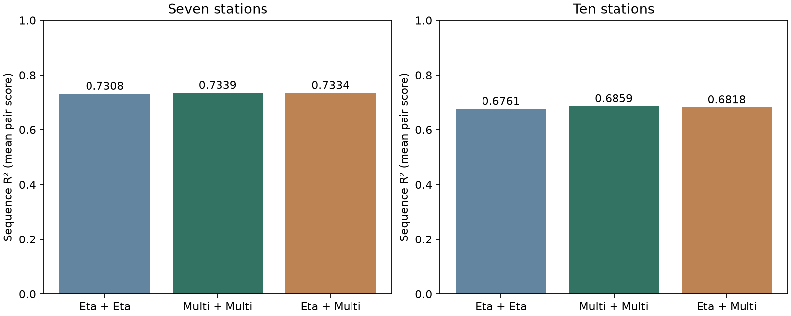

# Coastal Sea-Level Forecasting

We predict the next 24 hours of non-tidal sea-level residuals from the previous 24 hours of observations and environmental inputs. The original network contains seven northeastern US coastal stations and 34 input features. A separate ten-station Delaware network provides an additional spatial evaluation.

The project compares fixed-support Graph WaveNet experts, their HS-DT combination, and a C4 residual-correction model. VARX-Ridge and physical-loss models provide additional comparisons. The main question is what each added component contributes to forecast accuracy and uncertainty.

## Start here

```bash
python -m pip install -r requirements.txt
python -m unittest discover -s tests -v
python scripts/show_results.py
```

The tests use synthetic inputs. The viewer reads saved result tables and writes a comparison figure to `output/`. Full training needs the processed data described below.

## Methods

| Component | Role | Implementation |
|---|---|---|
| Fixed-support Graph WaveNet | Dilated temporal convolutions and graph diffusion | `src/models/graph/graph_wavenet.py` |
| Multistate GWN | Predicts residual, current, and wave-related states | `src/training/train_graph_experts.py` |
| HS-DT | Equal expert weights at Leads 1–23; Multistate at Lead 24 | `src/models/ensemble/hsdt.py` |
| C4 | Frozen experts, bounded gate/correction, Gaussian scale | `src/models/correction/c4.py` |
| VARX-Ridge | Strong linear comparator | `src/models/linear/varx.py` |
| Physical-loss GNN-BiGRU | Matched physical-residual diagnostic | `src/models/physics/multistate_gnn_bigru.py` |

## Results

- In the matched historical experiment, C4 improves sequence R² from **0.731914** to **0.739055** relative to HS-DT. The values are means of five separate runs.
- Ordinary same-supervision ensembles remain competitive. Cross-supervision averaging does not outperform Multi+Multi in the ten-station control. The results do not establish a unique benefit from supervision diversity.
- With the C4 mean held fixed, dynamic scale reduces CRPS from **0.048927 to 0.047039 m** in the seven-station test, and **0.064824 to 0.061739 m** in the ten-station test.
- Matched physical-prior effects are small or mixed. They do not explain the Multistate model's Lead-24 advantage.

The [manuscript](paper/manuscript.pdf) gives the full comparisons. [Evidence notes](docs/evidence.md) explain the evaluation periods and confidence intervals. CSV tables are in `results/`.



## Repository layout

```text
src/
  data/          # NOAA/ERA5 acquisition and feature construction
  models/
    graph/       # Fixed-support GWN and DCRNN
    ensemble/    # Fixed HS-DT combination
    correction/  # C4 and its protocol/metric helpers
    linear/      # VARX-Ridge
    physics/     # GNN-BiGRU physical-loss comparator
  training/      # Expert training and matched loss helpers
  evaluation/    # Ensemble and scale-only paired controls
scripts/         # Training, data checks, result viewer
tests/           # Synthetic model invariants
results/         # Small saved result tables
docs/            # Data, evidence, and refactoring notes
paper/           # Current manuscript
```

## Training and evaluation

Full training requires the processed data listed in [docs/data.md](docs/data.md). Data are not bundled. Model code uses training-fitted transformations and the protocol in `PROTOCOL.json`.

```bash
python scripts/check_data.py
python scripts/train_experts.py --seeds 42 --epochs 120
python src/models/correction/c4.py --seeds 42 --variants C4_HSDT_FROZEN_NO_PHYS --eta-results-root results/tier_a_graph_wavenet --multi-results-root results/tier_a_graph_wavenet
```

Use `--seeds 42 123 2024 2025 3407` for the five-seed experiment. C4 requires expert checkpoints from the previous command. The ensemble and scale controls require saved validation and test prediction caches; see [docs/reproduction.md](docs/reproduction.md).

## Data and scientific scope

The target is observed water level minus astronomical tide. It is a **non-tidal residual**, not a pure storm-surge label. Sources include NOAA CO-OPS, NDBC, ERA5, Copernicus Marine, and GEBCO. Historical forcing alignment is retrospective; these scores are not an issue-time deployment evaluation. Later-period and post-hoc comparisons are distinguished in the evidence notes.

## Project status

The manuscript is a research draft. Full forcing data and checkpoints are not included. A software license has not been selected; data use follows the terms of each source. The retained implementations and file renames are documented in [docs/refactoring.md](docs/refactoring.md).
